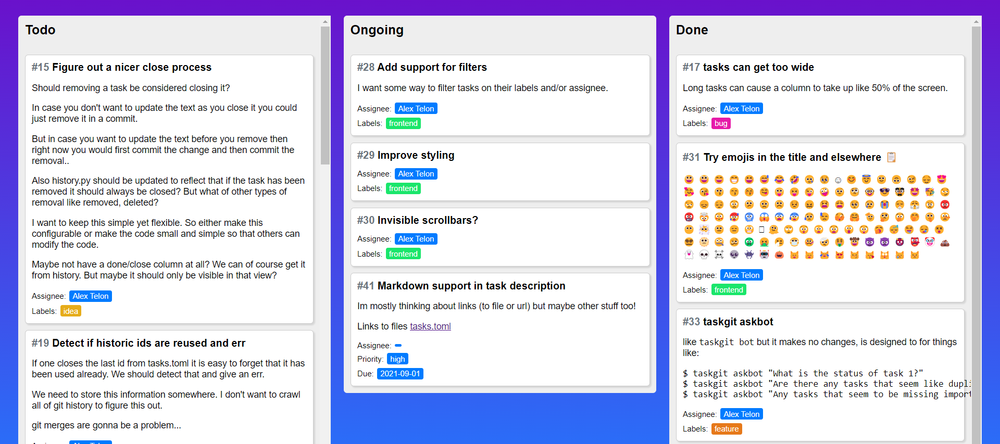

# Taskgit

Taskgit is a in-file task manager for git repositories. Its designed to be checked in to your source code repository.
Comes with a set of commands to help you manage your tasks and a static webpage generator to visualize the current state of your tasks.

Since it is all text you can also yous recent advances in large language models to do things like mass modify tasks.

## Features

 - Small codebase (< 500 lines of code)
 - Integration to git by storing it in git
 - Text first interface
 - Powerful command line interface thanks to openai API's
 - Generate a static webpage to visualize your tasks


  
Example of the visual output taskgit generates. (yes its ugly for now)

### Using AI to update your tasks
While openai's api's are not free to use they are cheap. 
But you dont have to use them. Integrate your own or use github copilot when modifying/adding tasks directly in the tasks.toml file.

Here is an example of using the `taskgit bot` cli command.

```git
# Let "chatgpt" modify your board with free text requests!
$ taskgit bot assign all tasks to Dondald Duck instead
# Using git diff to show the changes made
$ git diff tasks.toml
--- a/tasks.toml
+++ b/tasks.toml
@@ -7,7 +7,7 @@ hidden = ['backlog']
 id = 9
 title = "Generate githubpages with github actions"
 description = "Ideally the user should not have to generate it manually. It would be nice with a more generic solution however. Putting this on hold for now."
-assignee = "Alex Telon"
+assignee = "Donald Duck"
 column = "backlog"

 [[task]]
@@ -28,14 +28,14 @@ so that others can modify the code.

 Maybe not have a done/close column at all? We can ofc get it from history. But maybe it should only be visible in that view?
 """
-assignee = "Alex Telon"
+assignee = "Donald Duck"
 column = "todo"

 [[task]]
 id = 17
 title = "tasks can get too wide"
 description = "Long tasks can cause a column to take up like 50% of the screen."
-assignee = "Alex Telon"
+assignee = "Donald Duck"
 column = "todo"
...
```

## Installation

```bash
python -m pip install .
```

## Usage

```bash
# Create a tasks.toml
taskgit init

# This will generate a static webpage showing the tasks defined in tasks.toml.
# It will also open it for you in your default browser.
taskgit

# Create a minimal template for a task at the bottom.
taskgit add

# Use any and all args you can think of and it will write it to the task
taskgit add --title Improve err handling --description "Right now it does not give line numbers and context for unexpexted errors" --author "Alex Telon"

# But feel free to edit the text manually too!
```

## Task.toml

See the [task.toml](task.toml) file in this repository for an example.